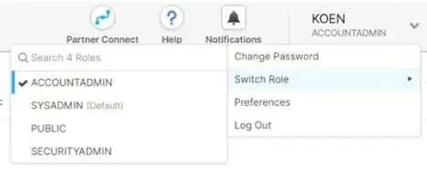
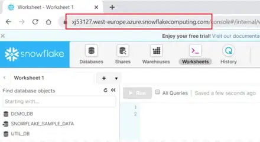
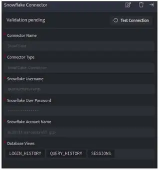

Snowflake connector pulls audit logs from the snowflake database, account\_usgae schema from various default audit views provided by snowflake.

###### **Pre-requisites**

You will need the following:

- A valid Snowflake account with the following credentials
    - Username
    
    - Password
    
    - Account Name

- Read snowflake database privileges

###### **Granting privileges**

By default, you're logged in using the SYSADMIN role. However, to view and change account information, you need to switch to the ACCOUNTADMIN role, which is the super admin role.

- Navigate to databases tab

- Click on the snowflake database (Not on the database name), a grant privileges drawer will open.  
    

- Grant imported privileges to sysadmin role.  
    

How to get account name?

- You'll have a unique URL with your account name in it to access your Snowflake environment:

- You can get the account name with the help of the following example. Example: &lt;account_name&gt;.snowflakecomputing.com  
      
    

###### **Configurations**

The following are the configurations to forward Snowflake Connector audit logs to DNIF.‌  

| **Field** | **Description** |
| --- | --- |
| Connector Name | Enter a name for the cField   Description   Connector Name   Enter a name for the connector   Connector Type   Enter Snowflake Connector   Snowflake Username   Enter the name of the Snowflake user   Snowflake User Password   Enter the password for Snowflake user   Snowflake Account Name   Enter the account name for Snowflake   Database views   Select the database views you want to get audit logs for. By default, QUERY\_HISTORY, SESSIONS and LOGIN\_HISTORY are selected, Views can be selected from the provided list;   ACCESS\_HISTORY   AUTOMATIC\_CLUSTERING\_HISTORY   COPY\_HISTORY   DATABASE\_STORAGE\_USAGE\_HISTORY   DATA\_TRANSFER\_HISTORY   LOAD\_HISTORY   LOGIN\_HISTORY   MATERIALIZED\_VIEW\_REFRESH\_HISTORY   METERING\_DAILY\_HISTORY   METERING\_HISTORY   PIPE\_USAGE\_HISTORY   QUERY\_HISTORY   REPLICATION\_USAGE\_HISTORY   SEARCH\_OPTIMIZATION\_HISTORY   SESSIONS   STAGE\_STORAGE\_USAGE\_HISTORY   STORAGE\_USAGE   TASK\_HISTORY   WAREHOUSE\_EVENTS\_HISTORY   WAREHOUSE\_LOAD\_HISTORY   WAREHOUSE\_METERING\_HISTORY   onnector |
| Connector Type | Enter Snowflake Connector |
| Snowflake Username | Enter the name of the Snowflake user |
| Snowflake User Password | Enter the password for Snowflake user |
| Snowflake Account Name | Enter the account name for Snowflake |
| Database views | Select the database views you want to get audit logs for. By default, QUERY\_HISTORY, SESSIONS and LOGIN\_HISTORY are selected, Views can be selected from the provided list;   ACCESS\_HISTORY   AUTOMATIC\_CLUSTERING\_HISTORY   COPY\_HISTORY   DATABASE\_STORAGE\_USAGE\_HISTORY   DATA\_TRANSFER\_HISTORY   LOAD\_HISTORY   LOGIN\_HISTORY   MATERIALIZED\_VIEW\_REFRESH\_HISTORY   METERING\_DAILY\_HISTORY   METERING\_HISTORY   PIPE\_USAGE\_HISTORY   QUERY\_HISTORY   REPLICATION\_USAGE\_HISTORY   SEARCH\_OPTIMIZATION\_HISTORY   SESSIONS   STAGE\_STORAGE\_USAGE\_HISTORY   STORAGE\_USAGE   TASK\_HISTORY   WAREHOUSE\_EVENTS\_HISTORY   WAREHOUSE\_LOAD\_HISTORY   WAREHOUSE\_METERING\_HISTORY |

- Click **Save** after entering all the required details and click **Test Connection**, to test the configuration.

- A **Connection successful** message will be displayed on screen along with the time stamp.

- If the connection is not successful an error message will be displayed. Refer [Troubleshooting Connector Validations](https://dnif.it/kb/troubleshooting-and-debugging/troubleshooting-connector-validations/) for more details on the error message.

Once the connector is configured, validate if the connector is listed under **[Collection Status](https://dnif.it/kb/operations/collection-status/)** screen with status as **Active**. This signifies the connector is configured successfully and data is ready to ingest.
