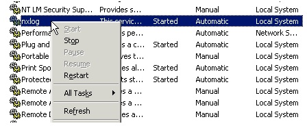

  
Internet Information Services (IIS) is a flexible, general-purpose web server from Microsoft that runs on Windows systems to serve requested HTML pages or files.

Supports integration with 32 bit and 64 bit Windows machines.

###### **Integration of IIS Webserver Logs via NXLog with DNIF**

To configure NXLog to send IIS Webserver access logs to DNIF Adapter.

If you want to integrate IIS Webserver access logs as well as Windows event logs, refer [Integrating Windows Event Logs](https://www.dnif.it/en/kb/windows-event-logs).

###### **Download and install Nxlog**

- Download and install the latest version of [NXLog](https://nxlog.co/products/nxlog-community-edition/download) on the Windows machine from which the logs need to be collected.

- After installation, locate the **nxlog.conf** file in the **C:\\Program Files (x86)\\nxlog\\conf** folder.

In **32 bit** Windows machines, look in the **C:\\Program Files\\nxlog\\conf** folder,


- Open the **nxlog.conf** file using a text editor. Replace the entire configuration by copy-pasting the text given for your Windows version.

**Windows x32 bit OS**

```
#============ Define ROOT here ===================define ROOT C:\Program Files\nxlog#define ROOT C:\Program Files (x86)\nxlog#============ NXLog Machine Log info =============Moduledir %ROOT%\modulesCacheDir %ROOT%\dataPidfile %ROOT%\data\nxlog.pidSpoolDir %ROOT%\dataLogFile %ROOT%\data\nxlog.log#=========== For IIS - default logs =============# For Following field sequence (ie : default)# Fields: date time s-sitename s-computername s-ip cs-method cs-uri-stem cs-uri-query s-port cs-username c-ip cs-version cs(User-Agent) cs(Cookie) cs(Referer) cs-host sc-status sc-substatus sc-win32-status sc-bytes cs-bytes time-taken<Extension w3c>Module xm_csvFields $date, $time, $SiteName, $SystemName, $DstIP, $HTTPMethod, $BaseURL, $URIQuery, $DstPort, $UserName, $SourceIP, $Cs-version, $UserAgent, $CS-Cookie, $HTTPReferer, $SourceHost, $HTTPRetCode, $Substatus, $Win32Status, $RXLen, $TXLen, $Time-TakenFieldTypes string, string, string, string, string, string, string, string, string, string, string, string, string, string, string, string, string, string, string, string, string, stringDelimiter ' 'QuoteChar '"'EscapeControl FALSEUndefValue -</Extension><Input IISin>Module im_fileFile 'C:\WINDOWS\system32\LogFiles\W3SVC1\ex*' ##path of log fileReadFromLast TRUEExec if $raw_event =~ /^#/ drop(); \else \{\w3c->parse_csv(); \$EventTime = parsedate($date + " " + $time); \}</Input><Output IISout>Module om_udpExec $raw_event = to_json();Host DNIF-Adapter-IPPort 514</Output><Route 1>Path IISin => IISout</Route>
```

**Windows x64 bit OS**

```
#============ Define ROOT here ===================#define ROOT C:\Program Files\nxlogdefine ROOT C:\Program Files (x64)\nxlog#============ NXLog Machine Log info =============Moduledir %ROOT%\modulesCacheDir %ROOT%\dataPidfile %ROOT%\data\nxlog.pidSpoolDir %ROOT%\dataLogFile %ROOT%\data\nxlog.log#=========== For IIS - default logs =============# For Following field sequence (ie : default)# Fields: date time s-sitename s-computername s-ip cs-method cs-uri-stem cs-uri-query s-port cs-username c-ip cs-version cs(User-Agent) cs(Cookie) cs(Referer) cs-host sc-status sc-substatus sc-win32-status sc-bytes cs-bytes time-taken<Extension w3c>Module xm_csvFields $date, $time, $SiteName, $SystemName, $DstIP, $HTTPMethod, $BaseURL, $URIQuery, $DstPort, $UserName, $SourceIP, $Cs-version, $UserAgent, $CS-Cookie, $HTTPReferer, $SourceHost, $HTTPRetCode, $Substatus, $Win32Status, $RXLen, $TXLen, $Time-TakenFieldTypes string, string, string, string, string, string, string, string, string, string, string, string, string, string, string, string, string, string, string, string, string, stringDelimiter ' 'QuoteChar '"'EscapeControl FALSEUndefValue -</Extension><Input IISin>Module im_fileFile 'C:\WINDOWS\system32\LogFiles\W3SVC1\ex*' ##path of log fileReadFromLast TRUEExec if $raw_event =~ /^#/ drop(); \else \{\w3c->parse_csv(); \$EventTime = parsedate($date + " " + $time); \}</Input><Output IISout>Module om_udpExec $raw_event = to_json();Host DNIF-Adapter-IPPort 514</Output><Route 1>Path IISin => IISout</Route>
```

- Restart **NXLog**

- To apply changes made on **nxlog.conf**, you have to restart the service again. Go to **Control Panel > Services** and locate the **nxlog** service.

- Right click on **nxlog** and click **restart**



IIS Webserver access logs are now streamed to DNIF.
